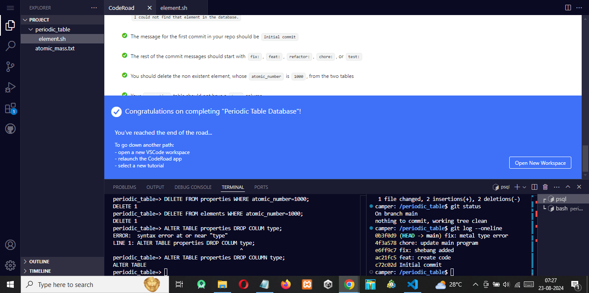

# Periodic Table Database

## Overview

The **Periodic Table Database** project is a comprehensive assignment designed for certification with Freecodecamp's relational database course. This project involves the creation and manipulation of a database to manage information about chemical elements. The goal is to develop a Bash script that retrieves information from this database effectively.

## Project Breakdown

The project is divided into three main parts:

1. **Fix the Database**: Adjust the database schema according to the specifications.
2. **Create Git Repository**: Set up a Git repository to manage the project's code and changes.
3. **Create a Script**: Develop a Bash script to interact with the database and display information.

## Task Requirements

### Database Modifications

1. **Column Renaming**:
   - Rename `weight` column to `atomic_mass`.
   - Rename `melting_point` column to `melting_point_celsius`.
   - Rename `boiling_point` column to `boiling_point_celsius`.

2. **Column Constraints**:
   - Ensure `melting_point_celsius` and `boiling_point_celsius` columns do not accept NULL values.
   - Add `UNIQUE` constraint to `symbol` and `name` columns in the `elements` table.
   - Apply `NOT NULL` constraint to `symbol` and `name` columns.

3. **Foreign Key Constraints**:
   - Set `atomic_number` column in the `properties` table as a foreign key referencing the `elements` table.

4. **Types Table Creation**:
   - Create a `types` table with the following columns:
     - `type_id`: INTEGER, Primary Key.
     - `type`: VARCHAR, NOT NULL.

5. **Types Data**:
   - Insert three rows into the `types` table, corresponding to the different element types from the `properties` table.

6. **Properties Table Updates**:
   - Add `type_id` column as a foreign key in the `properties` table, referencing the `type_id` column in the `types` table. Ensure it is an INT with a `NOT NULL` constraint.
   - Capitalize the first letter of all `symbol` values in the `elements` table.
   - Remove trailing zeros after decimals from `atomic_mass` values. Adjust the data type if necessary.

7. **Add New Elements**:
   - Insert element with atomic number 9 (Fluorine) and atomic number 10 (Neon) into the database.

8. **Clean Up**:
   - Remove the non-existent element with atomic number 1000 from both tables.
   - Drop the `type` column from the `properties` table.

### Git Repository Setup

1. **Initialize Repository**:
   - Create a `periodic_table` folder and initialize it as a Git repository with `git init`.

2. **Commits**:
   - Ensure the repository has at least five commits.
   - The initial commit message should be `Initial commit`.
   - Use commit messages with prefixes: `fix:`, `feat:`, `refactor:`, `chore:`, or `test:` for subsequent commits.

### Bash Script

1. **Script Creation**:
   - Create an `element.sh` file in the repository folder.

2. **Script Functionality**:
   - The script should have executable permissions.
   - If run without arguments, output: `Please provide an element as an argument.`
   - If run with an atomic number, symbol, or name, output the element’s details in a specific format.
   - If the input does not match any element, output: `I could not find that element in the database.`

## File Contents

- **`solution.txt`**: Contains code for fixing the database and creating the Git repository.
- **`atomic_mass.txt`**: Lists the corrected values for the `atomic_mass` column.

## Instructions

1. **Database Setup**: Follow the specifications in `solution.txt` to fix the database.
2. **Repository Management**: Initialize and manage your Git repository as described.
3. **Script Development**: Implement the `element.sh` script according to the provided requirements.

## Final Steps

- Ensure the repository is on the `main` branch with a clean working tree and no uncommitted changes.
- Validate all requirements are met and functioning correctly.

#Result

